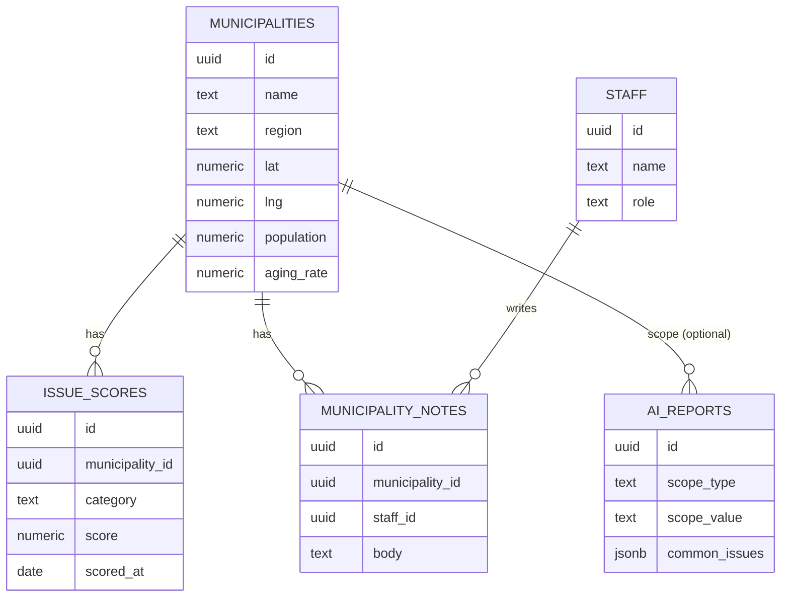

# 地域課題マップ・市町村カルテシステム

大阪府 市町村局振興課 内部職員向け業務システムの設計ドキュメントと実装コードです。
`app.html` を直接ブラウザで開くとそのまま動作する実装（プロトタイプ）が確認できます。

**スコープ**：地域課題マップ／市町村カルテ／AI分析の3機能を対象とします（相談・訪問履歴管理、ダッシュボード、アンケート結果分析は対象外）。

---

## 1. システム全体構成図

```
┌──────────────────────────────────────────────────────────────────┐
│                          利用者（振興課職員／管理職）                 │
│                     ブラウザ（PC・タブレット、レスポンシブ）           │
└───────────────────────────────┬──────────────────────────────────┘
                                 │ HTTPS
┌───────────────────────────────▼──────────────────────────────────┐
│  Frontend : Next.js (App Router) + TypeScript + Tailwind CSS       │
│             + shadcn/ui + Leaflet（地図） + Chart.js（グラフ）        │
│  ホスティング：Vercel 等                                            │
└───────────────────────────────┬──────────────────────────────────┘
                                 │ Supabase JS Client / REST
┌───────────────────────────────▼──────────────────────────────────┐
│  Backend : Supabase                                                │
│   ├─ PostgreSQL（市町村・スコア等）                                 │
│   ├─ Auth（職員ログイン・ロール管理）                                │
│   ├─ Edge Functions                                                │
│   │    └─ ai-analyze：OpenAI API呼び出し（APIキーはサーバー側で保持）  │
│   └─ Row Level Security（職員／管理職の権限分離）                     │
└───────────────────────────────┬──────────────────────────────────┘
                                 │ HTTPS
┌───────────────────────────────▼──────────────────────────────────┐
│  外部サービス：OpenAI API（AI分析生成）／ 国土地理院タイル（地図背景）  │
└──────────────────────────────────────────────────────────────────┘
```

**ポイント**
- 地図の背景は**国土地理院の地理院タイル「淡色地図」**（`https://cyberjapandata.gsi.go.jp/xyz/pale/{z}/{x}/{y}.png`）をLeafletで表示する。標準地図（等高線・道路網が密）は着色データと競合して見づらいため、データ可視化用に作られた淡色地図を採用している。利用は無償・APIキー不要だが、地理院タイルの利用規約に従い「地図：国土地理院」の出典表示を行う。
- 市町村は**コロプレス（境界ポリゴンの塗り分け）**で表示する。境界データは国土数値情報「行政区域データ（N03）」を基にしたGeoJSON（大阪市・堺市は区データを結合）を使用し、選択した指標のスコアで塗り分ける。円マーカーではなく実際の行政区域ポリゴンなので、都市部で市町村が重なって見えなくなる問題が発生しない。
- 地図の表示・パン可能範囲は、このポリゴンの外形（`getBounds()`）にフィットさせて固定する。これにより初期表示・パン・ズームのいずれでも近隣府県が大きく映り込まず、大阪府内に視点が留まる。
- OpenAI APIキーはクライアントに置かず、Supabase Edge Function経由で呼び出す（本ドキュメント末尾の実装コードはブラウザ単体で動くデモのため、AI分析はルールベースのローカル生成に代替している）。
- 検索速度重視のため、市町村マスタ・スコアはPostgreSQLに正規化しつつ、マップ表示用に集計済みビュー（`v_muni_scores`）を用意する。

---

## 2. 画面一覧

| # | 画面名 | 概要 | 主利用者 |
|---|---|---|---|
| 1 | ログイン | 職員認証（Supabase Auth） | 全員 |
| 2 | 地域課題マップ | 国土地理院地図（大阪府内に表示範囲を固定）上に市町村を配置し、8指標でスコア化・色分け表示 | 全員 |
| 3 | 市町村カルテ | 市町村ごとの基礎情報・課題・メモ | 全員 |
| 4 | AI分析 | 範囲選択→分析生成 | 管理職／担当者 |
| 5 | 設定（将来拡張） | ユーザー管理・課題指標の重み設定 | 管理職 |

---

## 3. 画面遷移図

```
[ログイン]
   │
   ▼
[地域課題マップ] ──円をクリック（ポップアップ）──▶ [市町村カルテ]
   │  ▲                                              │
   │  └──────────────戻る────────────────────────────┘  └─▶ [AI分析（市町村指定）]
   │
   └─▶ [AI分析：範囲選択] ──生成──▶ [AI分析：結果表示]
```

---

## 4. データベース設計（Supabase / PostgreSQL）

### 4.1 `municipalities`（市町村マスタ）
| カラム | 型 | 説明 |
|---|---|---|
| id | uuid (PK) | |
| name | text | 市町村名 |
| region | text | 地域ブロック（北大阪／北河内／中河内／南河内／泉北／泉南／大阪市域） |
| lat, lng | numeric | 代表座標（地図表示用） |
| population | integer | 人口 |
| pop_change_rate | numeric | 人口増減率(%) |
| aging_rate | numeric | 高齢化率(%) |
| area_km2 | numeric | 面積 |
| households | integer | 世帯数 |
| fiscal_index | numeric | 財政力指数 |
| updated_at | timestamptz | |

### 4.2 `issue_scores`（課題スコア／時系列で保持）
| カラム | 型 | 説明 |
|---|---|---|
| id | uuid (PK) | |
| municipality_id | uuid (FK) | |
| category | text | population/aging/vacant/transit/community/successor/disaster/dx |
| score | numeric(3,1) | 1.0〜5.0 |
| scored_at | date | スコア算出日 |
| source | text | manual / calculated |

### 4.3 `staff`（職員）
| id (PK, = auth.users.id) | name | role（staff/manager） | section |

### 4.4 `municipality_notes`（担当者メモ）
| id | municipality_id (FK) | staff_id (FK) | body | updated_at |

### 4.5 `ai_reports`（AI分析結果の保存・履歴化）
| id | scope_type（all/region/municipality） | scope_value | common_issues jsonb | distinctive_issues jsonb | directions jsonb | cooperation jsonb | generated_at | generated_by |

**インデックス方針**：`issue_scores(municipality_id, category, scored_at desc)` に複合インデックスを付与し、マップ・カルテ表示時の最新スコア取得を高速化する。

---

## 5. ER図



---

## 6. フォルダ構成（Next.js 実装時）

```
app/
├─ (auth)/login/page.tsx
├─ (dashboard)/
│   ├─ layout.tsx                 # サイドバー＋ヘッダーのシェル
│   ├─ map/page.tsx                # 地域課題マップ
│   ├─ karte/[municipalityId]/page.tsx
│   └─ ai/page.tsx
├─ api/
│   └─ ai-analyze/route.ts         # Edge Function呼び出しプロキシ（任意）
components/
├─ map/GsiTileMap.tsx, MuniMarker.tsx, MapLegend.tsx  # maxBoundsで大阪府に表示範囲を固定
├─ karte/StatGrid.tsx, IssueRadarChart.tsx, MemoEditor.tsx
├─ ai/ScopeSelector.tsx, ReportView.tsx
└─ ui/ (shadcn/ui 生成コンポーネント)
lib/
├─ supabase/client.ts, server.ts
├─ scoring.ts                      # スコア計算ロジック
└─ ai/prompt.ts                    # OpenAIプロンプト定義
supabase/
├─ migrations/*.sql
└─ functions/
    └─ ai-analyze/index.ts
```

---

## 7. API設計（Supabase Edge Functions / REST）

| Method | Path | 説明 |
|---|---|---|
| GET | `/rest/v1/municipalities` | 市町村一覧（+スコアはビュー結合、地図描画用の緯度経度を含む） |
| GET | `/rest/v1/municipalities?id=eq.{id}` | 市町村カルテ詳細 |
| GET/PATCH | `/rest/v1/municipality_notes?municipality_id=eq.{id}` | 担当者メモの取得・更新 |
| POST | `/functions/v1/ai-analyze` | `{scope_type, scope_value}` を受け取り、対象市町村の指標を集計してOpenAI APIへ渡し、`ai_reports`に保存して結果を返す |
| GET | `/rest/v1/ai_reports?...` | 過去のAI分析結果の再取得 |

`ai-analyze` の内部フロー：① scopeから対象市町村と最新スコアを集計 → ② プロンプトを構築 → ③ OpenAI Chat Completions APIをサーバー側で呼び出し（APIキーはEdge Functionの環境変数） → ④ 4セクション構造のJSONを保存・返却。

---

## 8. 実装手順

1. Supabaseプロジェクト作成、`municipalities`等のテーブルをマイグレーションで作成し、大阪府42市町村相当のマスタデータ（緯度経度含む）を投入。
2. Supabase Authで職員ログインを実装し、RLSポリシー（メモ編集は担当課、閲覧は全職員可）を設定。
3. Next.jsプロジェクトを作成し、shadcn/uiを導入、共通レイアウト（サイドバー・ヘッダー）を実装。
4. 地域課題マップ画面：Leaflet + 地理院タイル（標準地図）を表示し、`maxBounds`とコンテナのアスペクト比を大阪府の外形に合わせて表示範囲を固定。`v_muni_scores`ビューを参照してCircle Markerを色分け。将来的に大阪府市町村GeoJSONへ切替可能な構造にする。
5. 市町村カルテ画面：基本指標・レーダーチャート（Chart.js）・メモ編集（自動保存）を実装。
6. AI分析：`ai-analyze` Edge Functionを実装し、OpenAI APIキーをSupabaseのSecretsに登録。フロントは範囲選択→生成→結果表示のみ。
7. レスポンシブ調整・アクセシビリティ確認・権限（一般職員／管理職）別の表示制御を実装し、ステージング環境でUAT。

---

## 9. MVP（最小実用版）の開発計画

| フェーズ | 期間目安 | スコープ |
|---|---|---|
| Phase 0 | 1週 | Supabase/Next.js雛形、認証、市町村マスタ投入 |
| Phase 1（MVP） | 2〜3週 | 地域課題マップ（地理院タイル＋大阪府内固定表示＋Circle Marker）、市町村カルテ（基本指標＋レーダーチャート＋メモ） |
| Phase 2 | 1〜2週 | AI分析（Edge Function経由のOpenAI連携）、レポート保存 |
| Phase 3 | 継続 | 権限管理の精緻化、GeoJSONポリゴン地図への切替（府境での正確なクリップ表示）、指標重み設定のUI化等の拡張 |

MVP（Phase 1まで）で「地域課題の可視化」「カルテによる一元管理」という属人化解消の核心価値を先行提供し、以降のフェーズで分析機能を積み上げる。

---

## 10. 実装コード一式

`app.html`（同ディレクトリ）に、上記設計を反映した**単体HTMLで動作するプロトタイプ実装**を格納しています。ブラウザで直接開くだけで、地域課題マップ（国土地理院地図＋Leaflet、大阪府内に表示範囲固定）／市町村カルテ／AI分析（ルールベース生成デモ）が一通り動作します。

- 地図は実際に国土地理院の地理院タイル（標準地図）を読み込みます。表示範囲は大阪府のバウンディングボックスに`maxBounds`で固定し、地図コンテナも大阪府の形状（南北に長い）に合わせたアスペクト比にしているため、パン・ズームをしても近隣府県が大きく画面を占めません。市町村は緯度経度の実座標にCircle Markerとして配置し、選択した指標のスコアで色分けします。円をクリックするとポップアップから市町村カルテに遷移します。
- データはすべて内蔵のサンプルデータ（府内42市町村相当の人口・高齢化率等の推計値）。
- 担当者メモはブラウザの`localStorage`に保存されます（Supabase未接続のスタンドアロン版のため）。
- 本番実装（Next.js＋Supabase）へ移行する際は、`lib/scoring.ts`にスコア計算式を移し、`app.html`内の`computeScores`関数のロジックをそのまま利用できます。

**注記**：Claude Artifactのプレビュー（claude.ai上のホスト環境）では、セキュリティ上の制約により地理院タイルサーバーへの画像リクエストがブロックされ、地図の背景タイルが表示されない場合があります。`app.html`をこのリポジトリからダウンロードして通常のブラウザで直接開く、またはNext.js実装としてデプロイした場合は、この制約は適用されず地図タイルは正しく表示されます。
