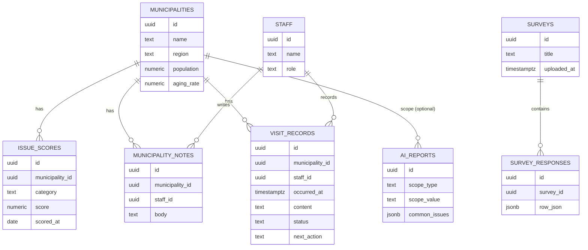

# 地域課題マップ・市町村カルテシステム

大阪府 市町村局振興課 内部職員向け業務システムの設計ドキュメントと実装コードです。
`app.html` を直接ブラウザで開くとそのまま動作する実装（プロトタイプ）が確認できます。

---

## 1. システム全体構成図

```
┌──────────────────────────────────────────────────────────────────┐
│                          利用者（振興課職員／管理職）                 │
│                     ブラウザ（PC・タブレット、レスポンシブ）           │
└───────────────────────────────┬──────────────────────────────────┘
                                 │ HTTPS
┌───────────────────────────────▼──────────────────────────────────┐
│  Frontend : Next.js (App Router) + TypeScript + Tailwind CSS       │
│             + shadcn/ui + Leaflet/Mapbox（地図） + Chart.js（グラフ） │
│  ホスティング：Vercel 等                                            │
└───────────────────────────────┬──────────────────────────────────┘
                                 │ Supabase JS Client / REST / Realtime
┌───────────────────────────────▼──────────────────────────────────┐
│  Backend : Supabase                                                │
│   ├─ PostgreSQL（市町村・スコア・履歴・アンケート等）                  │
│   ├─ Auth（職員ログイン・ロール管理）                                │
│   ├─ Storage（アップロードExcel・添付ファイル）                      │
│   ├─ Edge Functions                                                │
│   │    ├─ survey-import：Excel解析・集計                            │
│   │    └─ ai-analyze：OpenAI API呼び出し（APIキーはサーバー側で保持）  │
│   └─ Row Level Security（職員／管理職の権限分離）                     │
└───────────────────────────────┬──────────────────────────────────┘
                                 │ HTTPS
┌───────────────────────────────▼──────────────────────────────────┐
│  外部サービス：OpenAI API（AI分析生成）                              │
└──────────────────────────────────────────────────────────────────┘
```

**ポイント**
- OpenAI APIキーはクライアントに置かず、Supabase Edge Function経由で呼び出す（本ドキュメント末尾の実装コードはブラウザ単体で動くデモのため、AI分析はルールベースのローカル生成に代替している）。
- 地図はLeaflet＋GeoJSON（大阪府市町村境界データ）を使用。本デモHTMLでは外部タイル取得ができない実行環境向けに、地域ブロック×バブルのスキーマティックマップで代替。
- 検索速度重視のため、市町村マスタ・スコアはPostgreSQLに正規化しつつ、マップ表示用に集計済みビュー（`v_muni_scores`）を用意する。

---

## 2. 画面一覧

| # | 画面名 | 概要 | 主利用者 |
|---|---|---|---|
| 1 | ログイン | 職員認証（Supabase Auth） | 全員 |
| 2 | 地域課題マップ | 市町村を8指標でスコア化・色分け表示 | 全員 |
| 3 | 市町村カルテ | 市町村ごとの基礎情報・課題・メモ | 全員 |
| 4 | ダッシュボード | ランキング・分布・地域比較 | 管理職／担当者 |
| 5 | 相談・訪問履歴 一覧／検索 | 履歴の検索・閲覧 | 担当者 |
| 6 | 相談・訪問履歴 登録／編集 | 新規登録・編集（モーダル） | 担当者 |
| 7 | アンケート分析（アップロード） | Excel/CSVアップロード | 担当者 |
| 8 | アンケート分析（結果） | 単純集計・クロス集計・自由記述傾向 | 全員 |
| 9 | AI分析 | 範囲選択→分析生成 | 管理職／担当者 |
| 10 | 設定（将来拡張） | ユーザー管理・課題指標の重み設定 | 管理職 |

---

## 3. 画面遷移図

```
[ログイン]
   │
   ▼
[地域課題マップ] ──クリック──▶ [市町村カルテ]
   │  ▲                          │  │
   │  └────戻る───────────────────┘  ├─▶ [相談履歴（絞込表示）]
   │                                 └─▶ [AI分析（市町村指定）]
   │
   ├─▶ [ダッシュボード] ──ランキングクリック──▶ [市町村カルテ]
   │
   ├─▶ [相談・訪問履歴 一覧] ──＋登録──▶ (モーダル：新規登録) ──保存──▶ [一覧に反映]
   │
   ├─▶ [アンケート分析：アップロード] ──解析完了──▶ [アンケート分析：結果]
   │
   └─▶ [AI分析：範囲選択] ──生成──▶ [AI分析：結果表示]
```

---

## 4. データベース設計（Supabase / PostgreSQL）

### 4.1 `municipalities`（市町村マスタ）
| カラム | 型 | 説明 |
|---|---|---|
| id | uuid (PK) | |
| name | text | 市町村名 |
| region | text | 地域ブロック（北大阪／北河内／中河内／南河内／泉北／泉南／大阪市域） |
| lat, lng | numeric | 代表座標 |
| population | integer | 人口 |
| pop_change_rate | numeric | 人口増減率(%) |
| aging_rate | numeric | 高齢化率(%) |
| area_km2 | numeric | 面積 |
| households | integer | 世帯数 |
| fiscal_index | numeric | 財政力指数 |
| updated_at | timestamptz | |

### 4.2 `issue_scores`（課題スコア／時系列で保持）
| カラム | 型 | 説明 |
|---|---|---|
| id | uuid (PK) | |
| municipality_id | uuid (FK) | |
| category | text | population/aging/vacant/transit/community/successor/disaster/dx |
| score | numeric(3,1) | 1.0〜5.0 |
| scored_at | date | スコア算出日 |
| source | text | manual / calculated / survey |

### 4.3 `staff`（職員）
| id (PK, = auth.users.id) | name | role（staff/manager） | section |

### 4.4 `municipality_notes`（担当者メモ）
| id | municipality_id (FK) | staff_id (FK) | body | updated_at |

### 4.5 `visit_records`（相談・訪問履歴）
| id | municipality_id (FK) | staff_id (FK) | occurred_at | content | status（対応中/完了/フォローアップ予定） | next_action | created_at |

### 4.6 `surveys` / `survey_responses`
| surveys: id, title, uploaded_by, uploaded_at, file_path(Storage) |
| survey_responses: id, survey_id (FK), row_json (jsonb) … 列構造が可変のため jsonb で保持 |

### 4.7 `ai_reports`（AI分析結果の保存・履歴化）
| id | scope_type（all/region/municipality） | scope_value | common_issues jsonb | distinctive_issues jsonb | directions jsonb | cooperation jsonb | generated_at | generated_by |

**インデックス方針**：`issue_scores(municipality_id, category, scored_at desc)`、`visit_records(municipality_id, occurred_at desc)`、`visit_records`への全文検索用に`content`へGINインデックス（pg_trgm）を付与し検索速度を確保。

---

## 5. ER図



---

## 6. フォルダ構成（Next.js 実装時）

```
app/
├─ (auth)/login/page.tsx
├─ (dashboard)/
│   ├─ layout.tsx                 # サイドバー＋ヘッダーのシェル
│   ├─ map/page.tsx                # 地域課題マップ
│   ├─ dashboard/page.tsx          # ダッシュボード
│   ├─ karte/[municipalityId]/page.tsx
│   ├─ history/page.tsx
│   ├─ survey/page.tsx
│   └─ ai/page.tsx
├─ api/
│   ├─ ai-analyze/route.ts         # Edge Function呼び出しプロキシ（任意）
│   └─ survey-import/route.ts
components/
├─ map/ZoneMap.tsx, MuniBubble.tsx
├─ karte/StatGrid.tsx, IssueRadarChart.tsx, MemoEditor.tsx
├─ history/RecordTable.tsx, RecordFormDialog.tsx
├─ survey/UploadDropzone.tsx, TallyChart.tsx, CrossTabTable.tsx
├─ ai/ScopeSelector.tsx, ReportView.tsx
└─ ui/ (shadcn/ui 生成コンポーネント)
lib/
├─ supabase/client.ts, server.ts
├─ scoring.ts                      # スコア計算ロジック
└─ ai/prompt.ts                    # OpenAIプロンプト定義
supabase/
├─ migrations/*.sql
└─ functions/
    ├─ survey-import/index.ts
    └─ ai-analyze/index.ts
```

---

## 7. API設計（Supabase Edge Functions / REST）

| Method | Path | 説明 |
|---|---|---|
| GET | `/rest/v1/municipalities` | 市町村一覧（+スコアはビュー結合） |
| GET | `/rest/v1/municipalities?id=eq.{id}` | 市町村カルテ詳細 |
| GET/POST | `/rest/v1/visit_records` | 履歴の取得・登録（RLSで担当課に限定） |
| PATCH/DELETE | `/rest/v1/visit_records?id=eq.{id}` | 履歴更新・削除 |
| POST | `/functions/v1/survey-import` | Excelアップロード→解析→`surveys`/`survey_responses`へ保存 |
| GET | `/rest/v1/survey_responses?survey_id=eq.{id}` | 集計用データ取得 |
| POST | `/functions/v1/ai-analyze` | `{scope_type, scope_value}` を受け取り、対象市町村の指標を集計してOpenAI APIへ渡し、`ai_reports`に保存して結果を返す |
| GET | `/rest/v1/ai_reports?...` | 過去のAI分析結果の再取得 |

`ai-analyze` の内部フロー：① scopeから対象市町村と最新スコアを集計 → ② プロンプトを構築 → ③ OpenAI Chat Completions APIをサーバー側で呼び出し（APIキーはEdge Functionの環境変数） → ④ 4セクション構造のJSONを保存・返却。

---

## 8. 実装手順

1. Supabaseプロジェクト作成、`municipalities`等のテーブルをマイグレーションで作成し、大阪府43市町村相当のマスタデータを投入。
2. Supabase Authで職員ログインを実装し、RLSポリシー（自課データのみ編集可、閲覧は全職員可）を設定。
3. Next.jsプロジェクトを作成し、shadcn/uiを導入、共通レイアウト（サイドバー・ヘッダー）を実装。
4. 地域課題マップ画面：Leaflet + 大阪府市町村GeoJSONで境界表示、`v_muni_scores`ビューを参照して色分け。
5. 市町村カルテ画面：基本指標・レーダーチャート（Chart.js）・メモ編集（Supabase Realtimeで自動保存）を実装。
6. 相談・訪問履歴機能：一覧・検索・登録フォームをshadcn/uiのDialog+Formで実装、全文検索はpg_trgmを利用。
7. アンケート分析：アップロードUI→Edge Function `survey-import`でExcel解析（xlsxライブラリ）→結果をダッシュボード用に集計API化。
8. ダッシュボード：ランキング・分布・地域比較をSQLビュー＋Chart.jsで構築。
9. AI分析：`ai-analyze` Edge Functionを実装し、OpenAI APIキーをSupabaseのSecretsに登録。フロントは範囲選択→生成→結果表示のみ。
10. レスポンシブ調整・アクセシビリティ確認・権限（一般職員／管理職）別の表示制御を実装し、ステージング環境でUAT。

---

## 9. MVP（最小実用版）の開発計画

| フェーズ | 期間目安 | スコープ |
|---|---|---|
| Phase 0 | 1週 | Supabase/Next.js雛形、認証、市町村マスタ投入 |
| Phase 1（MVP） | 2〜3週 | 地域課題マップ（簡易配色）、市町村カルテ（基本指標＋レーダーチャート）、相談・訪問履歴のCRUD・検索 |
| Phase 2 | 2週 | アンケート分析（アップロード・単純集計・クロス集計） |
| Phase 3 | 1〜2週 | ダッシュボード（ランキング・分布・地域比較） |
| Phase 4 | 1〜2週 | AI分析（Edge Function経由のOpenAI連携）、レポート保存 |
| Phase 5 | 継続 | 権限管理の精緻化、GeoJSON地図への切替、指標重み設定のUI化等の拡張 |

MVP（Phase 1まで）で「地域課題の可視化」「カルテによる一元管理」「履歴の共有」という属人化解消の核心価値を先行提供し、以降のフェーズで分析機能を積み上げる。

---

## 10. 実装コード一式

`app.html`（同ディレクトリ）に、上記設計を反映した**単体HTMLで動作するプロトタイプ実装**を格納しています。ブラウザで直接開くだけで、地域課題マップ／市町村カルテ／相談・訪問履歴管理／アンケート結果分析／ダッシュボード／AI分析（ルールベース生成デモ）が一通り動作します。

- データはすべて内蔵のサンプルデータ（府内42市町村相当の人口・高齢化率等の推計値）。
- 相談履歴・担当者メモはブラウザの`localStorage`に保存されます（Supabase未接続のスタンドアロン版のため）。
- 本番实装（Next.js＋Supabase）へ移行する際は、`lib/scoring.ts`にスコア計算式を移し、`app.html`内の`computeScores`関数のロジックをそのまま利用できます。
